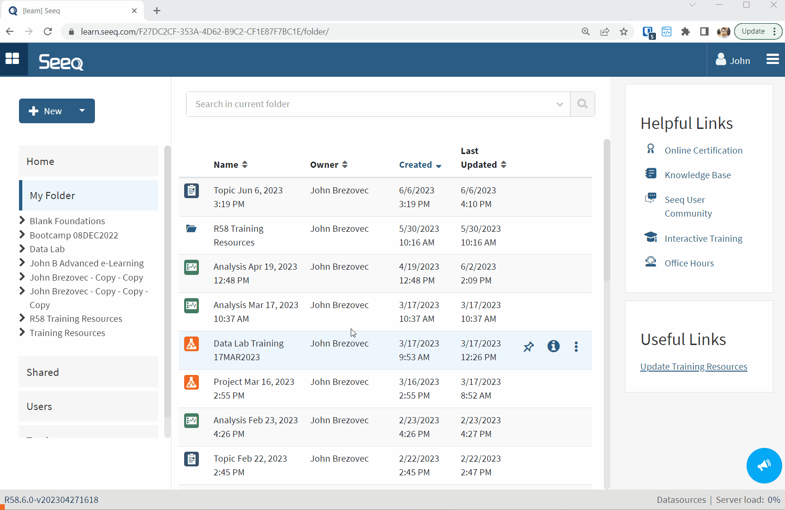
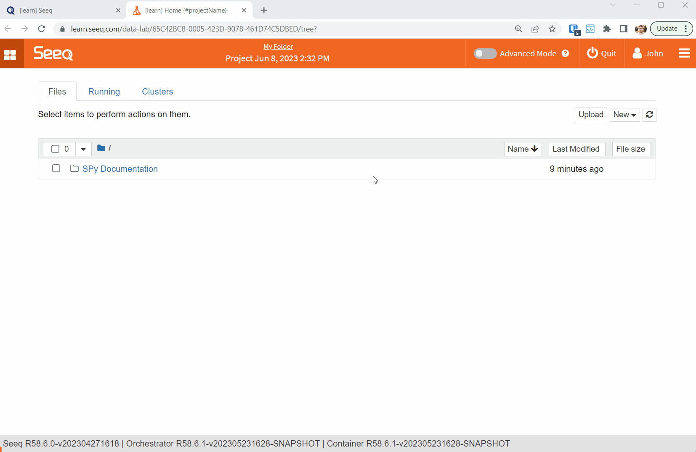

# Seeq Data Lab Training
This repository contains the exercises covered in Seeq Data Lab Training.

## Getting Started
1. Create a new Data Lab Project

2. Clone this repository into your Project:
    1. Rename your Project
    2. Enable Advanced Mode
    3. Navigate to the Git Sidebar
    4. Press the **Clone a Repository** button and paste `https://github.com/seeq12/training-seeq-data-lab` into the window.

## Notes
- The exercises build on each other and should be completed in order.
- The exercises are intended to be performed on our Learn environment.

